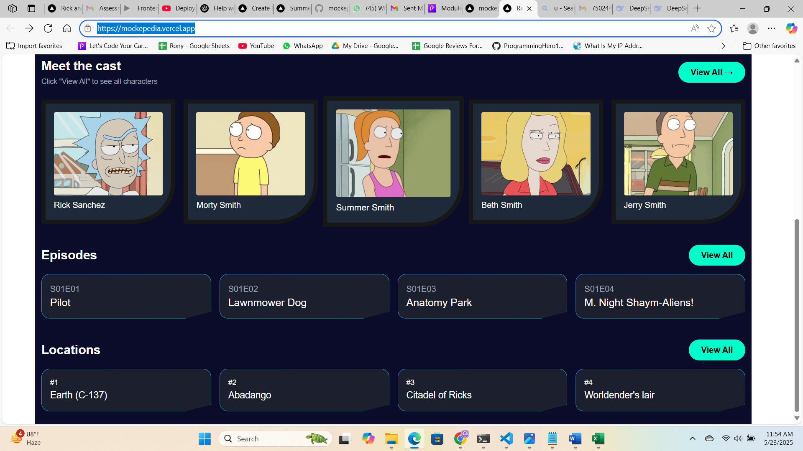
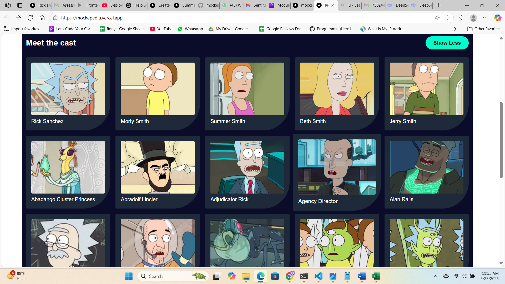
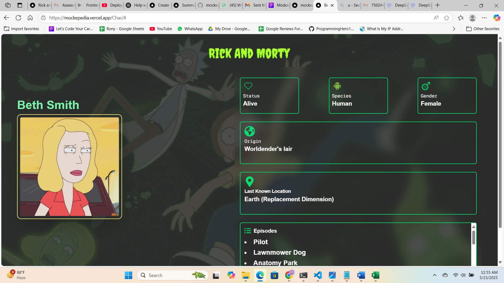

# Rick and Morty Wiki

A responsive character profile UI built with Next.js and Tailwind CSS that fetches data dynamically from the Rick and Morty API. View characters, episodes, and locations in a modern interface with animated and interactive elements.

---

## 🚀 Live Demo

🚀 [mockepedia](https://mockepedia.vercel.app)

---

## ✨ Features

- 📱 Fully responsive layout (mobile to desktop)  
- 🔄 Dynamic data fetching with Next.js App Router (Server & Client components)  
- 🎨 Modern UI with background images, gradient overlays, and frosted-glass effects  
- ⚛️ Interactive character cards with hover animations  
- 📜 Scrollable episodes list and collapsible "View All" sections  
- 🗺️ Locations and episodes sections with polygonal card designs  
- 🎉 "Back to Top" button when viewing full lists  

---

## 🛠 Tech Stack

- Next.js 14 (App Router)  
- React 18  
- Tailwind CSS  
- Rick and Morty API  
- React Icons  
- Local custom fonts via `next/font`

---

---

## 🖥️ Screenshots

---
---

## ⚙️ Usage

- Browse the homepage to see a featured banner and initial character cards.
- Click "View All" to expand characters, episodes, or locations.
- Click on a character card (in full view) to navigate to their detailed profile page.
- Use "Back to Top" to quickly return after expanding lists.

---

## 📚 API Endpoints

- Characters: `https://rickandmortyapi.com/api/character`
- Episodes:   `https://rickandmortyapi.com/api/episode`
- Locations:  `https://rickandmortyapi.com/api/location`

---

## 👨‍💻 Author

**Abu Yusuf Rony**  
Front-End Developer  

[GitHub Profile](https://github.com/abuyusufrony)

---

## 🎯 Goals / Learning Outcomes

- Mastered Next.js App Router with Server and Client Components  
- Leveraged Tailwind CSS for rapid, responsive UI development  
- Integrated public REST API data into SSR and CSR flows  
- Enhanced UX with animations, overlays, and interactive cards  

---

